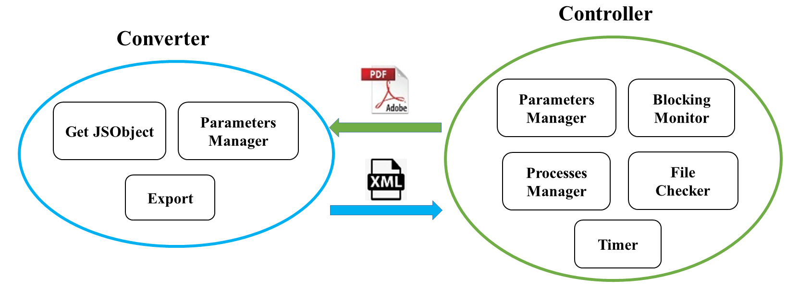

# PDFConvert

Convert pdf to any other formats using Adobe DC SDK, like txt, xml, doc, docx, jpg, ps, rft etc.
Notice: To run this project, you need install [Adobe Acrobat Pro DC](https://acrobat.adobe.com/us/en/free-trial-download.html?trackingid=KLBBQ).
We have not tested other versions of Adobe Acrobat. This link points to the download page of Acrobat Pro DC, you can try it for free for a few days. 

## Environment and Dependency 

* Operating system: Windows 10 Professional
* IDE: Visual Studio 2017 Community
* Development framework: . Net Framework 4.6.1
* Dependency:  
    - Acrobat   
    - Adobe Acrobat 10.0 Type Library  
    - System Windows Forms  
* The fist two are COM type libraries, after installing Adobe Acrobat DC, you can add reference in Visual Studio with project manager.

## How to build and run it

### Build PDFconvert

1. Create a C# Console project, and choose the . Net framework version.
2. Add references, click the COM in references manager and select Acrobat and Adobe Acrobat 10.0 Type Library.
3. To run this project, you need add command parameters in project manager, the input file  complete path and output dictionary(optional, if not specify, it will save the output file where the executable file in). You can also use console to run the executable file as follows:

``` 
    PDFConvert.exe -i inputfile -o outputdir -r true -t 20000
```

4. If you run this repository directly, you can skip step 1 and 2.

### Batch process with Python (Controller)

``` 
 python BatRun.py -e  C:\Users\~\PDFConvert.exe -i C:\Users\~ -o C:\Users\~ -f xml -t 60
```
**Dependency**  
- python3.5+
- pywin32
- BeautifulSoup4
- docx
- xlrd  

**Notice**  
If you run this python command in cmd console or Powershell of Windows10, you'd be better disable 'QuickEdit Mode' and 'Insert Mode' every time to avoid the process stuck in suspended state.  Simply right click up the top of your powershell console, head down to properties and under Edit options you will see 'QuickEdit Mode'.
## Architecture 



## Extension

If you want to convert pdf to other formats, 
The cConvIDs supported by Acrobat library. The list of cConvIDs are as follows:  

| cConvID                              |           extension          |     comment     |
|--------------------------------------|:----------------------------:|:---------------:|
| com.adobe.acrobat.eps                |              eps             |     Not test    |
| com.adobe.acrobat.html-3-20          |           html, htm          | **Recommended** |
| com.adobe.acrobat.html-4-01-css-1-00 |           html, htm          |     Run well    |
| com.adobe.acrobat.jpeg               |        jpeg , jpg, jpe       |     Not test    |
| com.adobe.acrobat.jp2k               | jpf, jpx, jp2, j2k, j2c, jpc |     Not test    |
| com.adobe.acrobat.doc                |              doc             |     Run well    |
| com.adobe.acrobat.docx               |             docx             |     Run well    |
| com.callas.preflight.pdfa            |              pdf             |     Not test    |
| com.callas.preflight.pdfx            |              pdf             |     Not test    |
| com.adobe.acrobat.png                |              png             |     Not test    |
| com.adobe.acrobat.ps                 |              ps              |     Not test    |
| com.adobe.acrobat.rtf                |              rft             |     Not test    |
| com.adobe.acrobat.accesstext         |              txt             |     Run well    |
| com.adobe.acrobat.plain-text         |              txt             |     Run well    |
| com.adobe.acrobat.tiff               |           tiff, tif          |     Not test    |
| com.adobe.acrobat.xml-1-00           |              xml             | **Recommended** |
| com.adobe.acrobat.xlsx               |             xlsx             |     Run well    |

In Acrobat 10.0 

| Deprecated cConvID                     | Equivalent Valid cConvID |
|----------------------------------------|--------------------------|
| com.adobe.acrobat.html-3-20            | com.adobe.acrobat.html   |
| com.adobe.acrobat.htm l- 4-01-css-1-00 | com.adobe.acrobat.html   |

Refer to [Acrobat SDK and documents](https://www.adobe.com/devnet/acrobat/documentation.html) to learn more. You can download the SDK package, and develop application on the samples.

## Comparison

| Format | Convert speed | Extract table | Complete | Analyze |
|:------:|:-------------:|:-------------:|:--------:|:-------:|
|   XML  |      Fast     |      Yes      |   Good   |   Easy  |
|  Word  |      Slow     |      Yes      |   Good   | General |
|  Excel |    General    |      Yes      |   Great  |   Hard  |
|   TXT  |     Fatest    |       No      |  General | Hardest |
|  HTML  |      Slow     |      Yes      |   Best   |   Easy  |

# Statement
The source code is for learning and communication only.
Please contact [Adobe](https://www.adobe.com/cn/) for commercial use.

# License
[Apache License 2.0](./LICENSE)